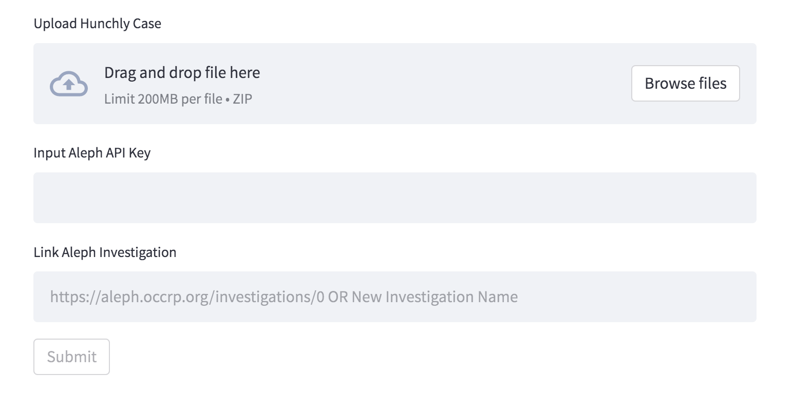

# 🔎 Upload Hunchly to OCCRP Aleph

**How-To Guide:**
This web GUI takes your [Hunchly](https://www.hunch.ly) case and uploads it to 
[OCCRP Aleph](https://aleph.occrp.org/). Note that it only uploads mhtml files and does NOT process
images or attachments. Export your Hunchly case, upload the zip file, input your Aleph API Key, and link the Aleph investigation 
to upload to. Finally, click Submit and wait for the tool to upload all files.

- To export your Hunchly Case: Open Hunchly, go to Export, and click "Export Case".
- To get your Aleph API Key: Go to [Settings](https://aleph.occrp.org/settings), and copy "API Secret Access Key".
- To link a Aleph Investigation: Go to [Investigations](https://aleph.occrp.org/investigations), select one, and input the link that appears in the top bar. \
To create a new investigation, input a new name instead of a link.

Made with ❤️ in Berkeley by the [Berkeley Investigative Reporting Program](https://journalism.berkeley.edu/programs/mj/investigative-reporting/) (with source code
from the Hunchly team).

